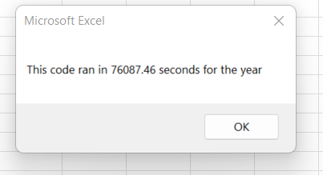

# Election_Analysis
ModuleChallege2

## Overview of Project-
     In this project we created a workbook for Steve so that he could analyze entire dtataset easily for his parents. As his parents were interested in analyzing the entire stock market before spending in it therefore, we included many stocks and made an efficient code to get answers in seconds for Steve and his parents.
## Purpose- 
      Pupose was to analyze stock market containing thousands of stocks, with the help of effective code for Steve and his parents.

 ## Results-
     Results for stock market 2017 showed that some stocks like DQ, ENPH and SEDG did really well while TERP stock fell down by approximately 8% 
      

      But in 2018 all sticks showed a great fall except ENPH and RUN, which were fairly good.  
      We were also able to calculate run time for both years, which took almost same amount of time to run for both years. 
      
      

## Summary-
    1. What are the advantages or disadvantages of refactoring code?
    **Advantage** of refactoring code  is that it is a sharp weapon for developers in their maintenance activities. It makes a software system easier to understand and cheaper to modify without changing its observable behavior by changing its internal structure. It also helps to find bugs, makes programming faster and improves design.
    ** Disadvantages **  It's risky when the application is big and when the existing code doesn't have proper test cases. Also it is a hassel when developers do not understand what's all about.
   2. How do these pros and cons apply to refactoring the original VBA script?
   The above pros and cons overall helps to improve the code initally mede. But sometimes when we work on it after a long time we might be lost and would have to over the code with minute details rather than on the improved version to understand it.
   So in short, refactoring is good in one way but can become a botheration if proper notes are not inserted for description of why the code has been refactored.  